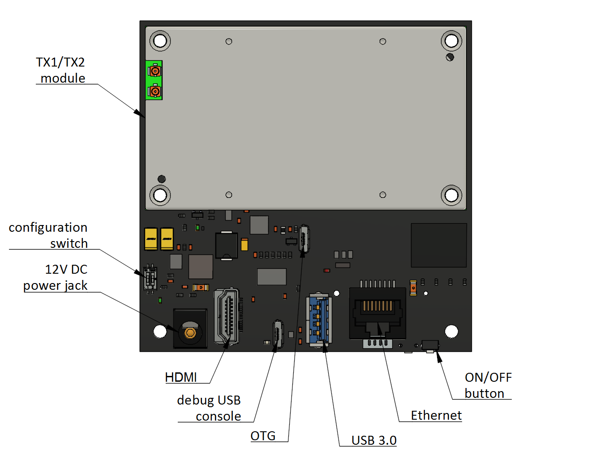
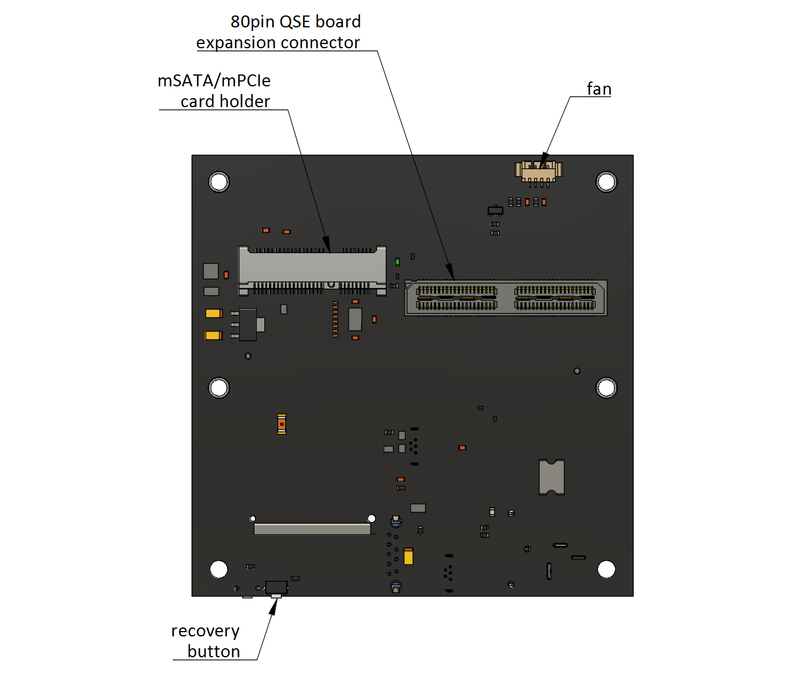

=============================
Antmicro Jetson TX2 baseboard
=============================

Copyright (c) 2020 Antmicro <`www.antmicro.com <https://www.antmicro.com>`_>

.. image:: Images/tx.png

Overview
========

This repository contains open hardware design files for a baseboard supporting the NVIDIA Jetson TX2/TX2i/TX family of System-on-Modules.
The board exposes typical IO interfaces and enables connecting multiple MIPI CSI-2 cameras over dedicated expansion boards.

Features
========

* SEAM connector for NVIDIA Jetson TX1/TX2 modules
* 80 pin stacking board-to-board Samtec QSE connector allowing to connect camera expansion boards
* USB 3.0 host interface
* HDMI output
* 2x micro USB (debug and OTG)
* mPCIe/mSATA card holder
* RJ45 Gb Ethernet connector
* 12-19V DC supply voltage

Layout
======

Getting started
===============

The board can be produced and assembled using the provided design files.
Please, refer to the mechanical layers for more information regarding the PCB stackup recommended for fabrication.
The board accepts power supply voltage in the 12-19VDC range.
It is recommended to use a 12V 2A DC supply to power the board.

Connect the board to your PC using a microUSB cable.
A new serial device will appear in your system.
It is advisable to access TX1/TX2 debug UART interface for the first boot using any terminal client.
The default connection baudrate is 115200 with 8-bit transmission, 1 stop bit and no flow control.
As the next step, connect a display to the HDMI port.
The module will start automatically right after applying the power supply.

